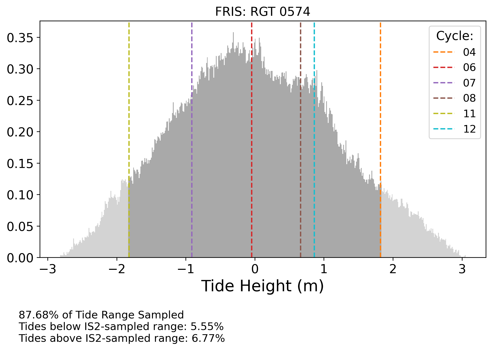

# Tidal-GL-Migration-ICESat-2

Code used in analysis of tidal grounding line migration at Bungenstockrucken, Antarctica.

Publication Pre-Print: https://doi.org/10.5194/tc-2022-265

Author: Bryony Freer, British Antarctic Survey
Co-Authors: Oliver Marsh, Anna Hogg, Helen A. Fricker, Laurie Padman

### Notebooks (to be executed in order) - _(conda environment)_: 

(1) Compute ATL06 Along-Track Tides-published - _(pyTMD)_

(2) ATL06_PlotRepeatTracks-published - _(tidal-mig)_

(3) Plot Tide Distribution for XYT-published - _(pyTMD)_

(4) Identify F Points by Tide-published - - _(tidal-mig)_

### Python Conda Environments
* _tidal-mig_ : install using the *environment.yml* file in this directory. 
* _pyTMD_ : install using the *tides/environment.yml* file.

### Required Downloads
* ATL06 granules over study area. Download link: https://nsidc.org/data/atl06/versions/5
* *CATS2008 tide model*. CATS2008 is available for download through the U.S. Antarctic Program Data Center: Data DOI: 10.15784/601235. Download link: https://www.usap-dc.org/view/dataset/601235

### Example Outputs:
**(2) ATL06_PlotRepeatTracks-published**
* Along-track elevation profile per ground track 

* Along-track elevation anomalies per ground track

**(3) Plot Tide Distribution for XYT-published**
* Histogram of annual tide distribution, highlighting the tides sampled for each RGT.

**(4) Identify F Points by Tide**
* Elevation anomaly per cycle, with 2nd derivative used to locate Point F

* CSV of Point F locations to be plotted on map

### Code Structure

